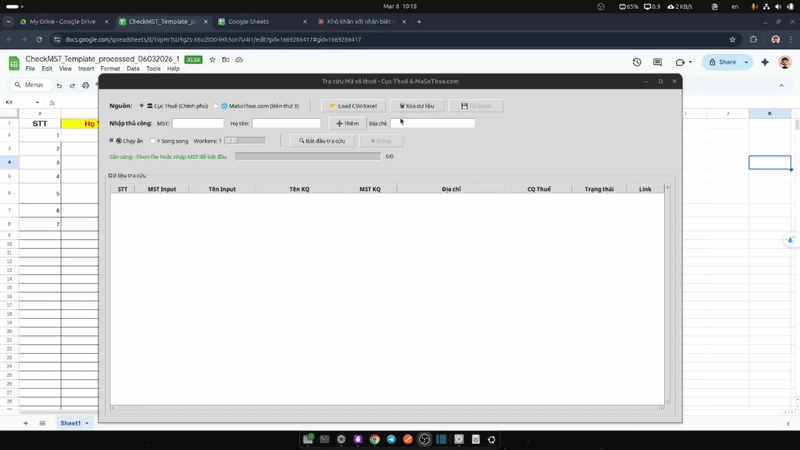
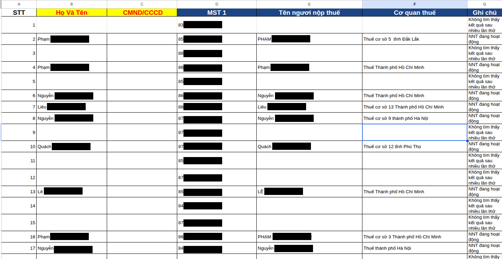
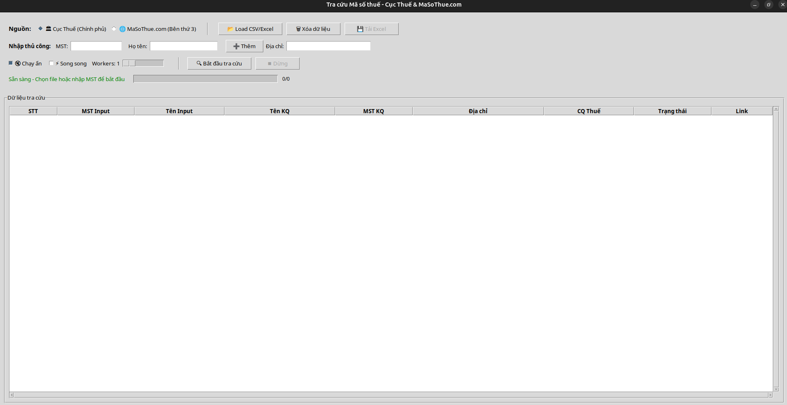
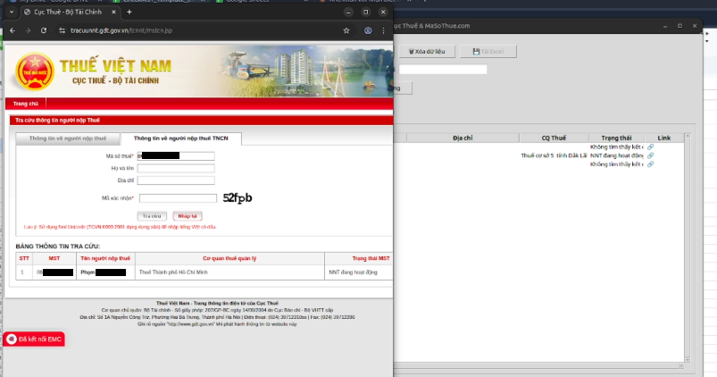

# 🔍 Tax Lookup Tool — Tra cứu MST / CCCD

Tự động tra cứu Mã số thuế và CCCD tại `masothue.com`, xuất kết quả ra Excel với độ chính xác cao.



## 🎯 Tính năng nổi bật

- ✅ **Độ chính xác cao**: 97.36% accuracy trong việc giải captcha tự động
- ✅ **Tra cứu hàng loạt**: Xử lý nhiều MST/CCCD cùng lúc
- ✅ **Parallel Mode**: Tăng tốc 3-5 lần với nhiều browser instances
- ✅ **GUI thân thiện**: Giao diện đồ họa dễ sử dụng
- ✅ **Bypass Cloudflare**: Tự động vượt qua bot detection
- ✅ **Xuất Excel**: Kết quả có hyperlink clickable

## 📊 Hiệu suất

Dựa trên test với 303 captcha images:
- **Accuracy**: 97.36%
- **Correct predictions**: 295/303
- **Error rate**: 2.64%

Chi tiết lỗi phổ biến:
- 1 ký tự sai: 7 cases
- 2 ký tự sai: 1 case
- Lỗi thường gặp: n↔h, p↔d/b, số 3↔4, 6↔5

### Ví dụ captcha được giải thành công:

<table>
<tr>
<td><br/><code>2ex3c</code></td>
<td><br/><code>5fewf</code></td>
<td><br/><code>8wheh</code></td>
<td><br/><code>bgyy5</code></td>
</tr>
<tr>
<td><br/><code>cxc7r</code></td>
<td><br/><code>ff5f8</code></td>
<td><br/><code>gxdye</code></td>
<td colspan="1"></td>
</tr>
</table>



## 📁 Cấu trúc project

```
tax_lookup/
├── gui_app.py       ← GUI Application (giao diện đồ họa)
├── app.py           ← CLI Application (dòng lệnh)
├── scraper.py       ← Logic tra cứu và parse HTML
├── data.csv         ← Danh sách MST/CCCD cần tra cứu
├── output.xlsx      ← Kết quả (tự tạo sau khi chạy)
└── requirements.txt
```

## ⚙️ Cài đặt

### Bước 1: Clone repository và tạo virtual environment

```bash
# Clone project (hoặc download ZIP)
git clone <repository-url>
cd tax-research/v2

# Tạo virtual environment
python3 -m venv venv

# Kích hoạt virtual environment
source venv/bin/activate  # Linux/macOS
# hoặc
venv\Scripts\activate     # Windows
```

### Bước 2: Cài đặt dependencies

```bash
# Cài Python packages
pip install -r requirements.txt

# Cài tkinter (cho GUI) - Trên Linux
sudo apt-get install python3-tk

# macOS thường đã có sẵn, hoặc:
brew install python-tk
```

### Bước 3: Cài ChromeDriver (cho Selenium)

```bash
# Linux:
sudo apt-get install chromium-chromedriver

# macOS:
brew install chromedriver

# Windows: Tải từ https://chromedriver.chromium.org/downloads
```

### Bước 4: Kiểm tra cài đặt

```bash
python check_install.py
```

## 🖥️ GUI Application (Khuyến nghị)

### Giao diện chính



### Demo hoạt động



### Cách chạy

```bash
# Kích hoạt virtual environment (nếu chưa)
source venv/bin/activate

# Chạy GUI
python gui_app.py
```

### Tính năng:
- ✅ Load dữ liệu từ file CSV
- ✅ Nhập thủ công MST/CCCD/Tên
- ✅ **⚡ Chế độ Parallel - Tra cứu nhanh với nhiều browsers**
- ✅ Tra cứu hàng loạt với progress bar
- ✅ Preview kết quả trong bảng
- ✅ Xuất ra file Excel
- ✅ Bypass Cloudflare bằng Selenium (Chrome browser tự động mở)

### Parallel Mode trong GUI:
- Tick "⚡ Chạy song song (Parallel)" để bật
- Kéo slider để chọn số workers (1-10)
- Tick "Chạy ẩn" để không hiển thị browsers
- Tốc độ tăng 3-5 lần với 5 workers!

**Lưu ý:** Chrome browser sẽ mở tự động khi tra cứu để bypass Cloudflare. Không đóng cửa sổ browser trong khi đang tra cứu.

## 📝 Chuẩn bị data.csv

| Cột | Bắt buộc | Mô tả |
|-----|----------|-------|
| `mst` hoặc `cccd` | ✅ | Mã số thuế hoặc CCCD |
| `ho_ten` | ❌ | Họ tên (có thể để trống) |

Ví dụ:
```csv
mst,ho_ten
079203002600,Phạm Minh Hoàng
8673726199,Nguyễn Văn A
```

## 🚀 CLI (Command Line)

```bash
# Tra cứu từ data.csv → output.xlsx (mặc định)
python app.py

# Tùy chỉnh file input/output
python app.py --input danh_sach.csv --output ketqua.xlsx

# Xuất CSV thay vì Excel
python app.py --format csv --output ketqua.csv

# Tra cứu nhanh 1 MST/CCCD
python app.py --mst 079203002600

# ⚡ PARALLEL MODE - Tra cứu nhanh với nhiều browsers
python app.py --workers 5  # Chạy song song với 5 browsers
python app.py --workers 7 --input data.csv  # 7 browsers cho file lớn
python app.py --no-parallel  # Tắt parallel, chạy tuần tự

# Test scraper 1 MST
python scraper.py 079203002600
```

### ⚡ Parallel Mode (Mới!)

Chạy nhiều browser instances đồng thời để tăng tốc độ tra cứu 3-5 lần!

**Demo nhanh (xem 5 browsers mở ra):**
```bash
python demo_parallel.py
```

**Cấu hình trong config.json:**
```json
{
    "parallel": {
        "enabled": true,
        "num_workers": 5,
        "use_profiles": true,
        "profiles_dir": "./browser_profiles"
    }
}
```

**Khuyến nghị:**
- 20-50 MST: 3-5 workers (~1.5GB RAM)
- 50-100 MST: 5-7 workers (~2GB RAM)  
- >100 MST: 7-10 workers (~3GB RAM)

**Mỗi worker có:**
- ✅ Browser profile riêng (cookies/session độc lập)
- ✅ User agent khác nhau
- ✅ Không conflict với workers khác
- ✅ Tái sử dụng profile (nhanh hơn lần sau)

**Xem chi tiết:** 
- [PARALLEL_MODE.md](PARALLEL_MODE.md) - Hướng dẫn sử dụng
- [ACCOUNTS_SETUP.md](ACCOUNTS_SETUP.md) - Cấu hình profiles/tài khoản

## 📊 Kết quả output.xlsx

| Cột | Nội dung |
|-----|----------|
| MST Input | Mã số thuế/CCCD đã tra |
| Tên Input | Dữ liệu từ CSV của bạn |
| Tên NNT | Tên do hệ thống thuế trả về |
| MST Kết quả | MST chính thức |
| Địa chỉ | Địa chỉ đăng ký kinh doanh |
| Cơ quan thuế | Chi cục thuế quản lý |
| Trạng thái | Đang hoạt động / Ngừng hoạt động... |
| Lỗi | Lỗi nếu có (không tìm thấy, timeout...) |
| Link | 🔗 Hyperlink clickable đến trang masothue.com |

## ⚠️ Lưu ý

- **GUI sử dụng Selenium với Chrome browser** để bypass Cloudflare bot detection
- Browser sẽ mở tự động (không ẩn danh) khi tra cứu
- Tool có delay giữa mỗi request để tránh bị chặn
- CCCD 12 số sẽ tự động tìm kiếm MST tương ứng
- MST 10 số sẽ tra cứu thông tin chi tiết
- Cần kết nối internet

## 🔧 Troubleshooting

### Lỗi 403 Forbidden
- Đã được fix bằng Selenium trong GUI
- Nếu vẫn gặp lỗi, thử tăng delay giữa các request

### ChromeDriver không tìm thấy
```bash
# Linux
sudo apt-get install chromium-chromedriver

# Hoặc tải thủ công và thêm vào PATH
```

### Tkinter không có
```bash
# Linux
sudo apt-get install python3-tk
```

## 📁 Cấu trúc project

```
tax-research/v2/
├── gui_app.py           ← GUI Application (giao diện đồ họa)
├── app.py               ← CLI Application (dòng lệnh)
├── scraper.py           ← Logic tra cứu và parse HTML
├── train_svm.py         ← Train model giải captcha
├── scan_code_svm.py     ← Scan và test accuracy
├── data.csv             ← Danh sách MST/CCCD cần tra cứu
├── output.xlsx          ← Kết quả (tự tạo sau khi chạy)
├── base/
│   └── TAX_FORM.xlsx    ← Template Excel
├── public/              ← Assets và demo images
├── requirements.txt     ← Python dependencies
└── venv/                ← Virtual environment (sau khi cài)
```

## 📄 License

MIT License

Copyright (c) 2026 Tax Research Tool

Permission is hereby granted, free of charge, to any person obtaining a copy
of this software and associated documentation files (the "Software"), to deal
in the Software without restriction, including without limitation the rights
to use, copy, modify, merge, publish, distribute, sublicense, and/or sell
copies of the Software, and to permit persons to whom the Software is
furnished to do so, subject to the following conditions:

The above copyright notice and this permission notice shall be included in all
copies or substantial portions of the Software.

THE SOFTWARE IS PROVIDED "AS IS", WITHOUT WARRANTY OF ANY KIND, EXPRESS OR
IMPLIED, INCLUDING BUT NOT LIMITED TO THE WARRANTIES OF MERCHANTABILITY,
FITNESS FOR A PARTICULAR PURPOSE AND NONINFRINGEMENT. IN NO EVENT SHALL THE
AUTHORS OR COPYRIGHT HOLDERS BE LIABLE FOR ANY CLAIM, DAMAGES OR OTHER
LIABILITY, WHETHER IN AN ACTION OF CONTRACT, TORT OR OTHERWISE, ARISING FROM,
OUT OF OR IN CONNECTION WITH THE SOFTWARE OR THE USE OR OTHER DEALINGS IN THE
SOFTWARE.

---

**Developed with ❤️ for Vietnamese tax research**# tax-reseach
